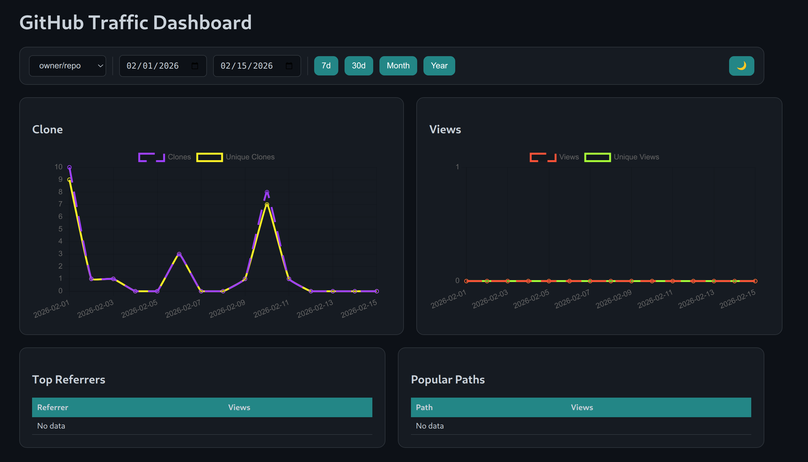

# GitHub Traffic Monitor



A self-hosted web dashboard to monitor GitHub repository traffic metrics including clones, views, popular referrers, and popular paths. Like Github but with more historical data.

**Docker Hub:** [DOCKER HUB](https://hub.docker.com/r/jrvolt/gh_watcher)

## Features

- 📊 Real-time traffic charts (clones, unique clones, views, unique views)
- 🔍 Popular referrers and paths tracking
- 📅 Flexible date range selection with quick presets (7d, 30d, Month, Year)
- 🌓 Dark/Light theme toggle
- 🔄 Automatic background data fetching on configurable intervals

## Requirements

- Docker & Docker Compose
- GitHub Personal Access Token (with `repo` scope for traffic data access)

## Quick Start

### Option 1: Using Pre-built Docker Image

1. using `SAMPLE_docker-compose.yml`:

2. Configure environment variables:
   - `GITHUB_TOKEN`: Your GitHub personal access token
   - `REPOS`: Comma-separated list of repositories (format: `owner/repo`)
   - `UPDATE_HOURS`: Hours between automatic data fetches (default: 24)

3. Start the container:

```bash
docker-compose up -d
```

4. Access the dashboard at `http://localhost:8000`


### Getting a GitHub Token

1. Go to GitHub Settings → Developer settings → Personal access tokens
2. Click "Generate new token"
3. Select "All repositories" or "Only select repositories"
4. In permission add "metadata" and "administration" with READ-ONLY permission
5. Generate token 
6. Copy token to `docker-compose.yml`


### Manual Data Fetch

Trigger an immediate data fetch without waiting for the schedule:

```bash
curl -X POST http://localhost:8000/fetch-now
```

## Troubleshooting

### No data showing on first launch

The app fetches data immediately on startup. If data doesn't appear:
1. Check logs: `docker logs GH_Watcher`
2. Verify `GITHUB_TOKEN` is valid
3. Verify `REPOS` format is correct: `owner/repo`
4. Manually trigger fetch: `curl -X POST http://localhost:8000/fetch-now`

### Token errors

- Ensure token has right permission
- Check token hasn't expired
- Verify token in `docker-compose.yml` has no extra spaces


## License

GPLv3
